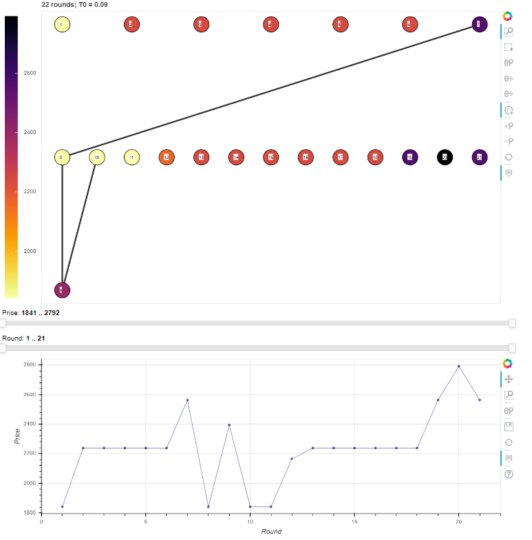

Monte-Carlo tree search aided with the technique of simulated annealing to approximate global minimum where the hierarchical domain structure of the state space is paired up with an increasing importance of exploiting known routes as the algorithm proceeds.
It is helpful when the runtime is a sensitive parameter and there is no capacity for an exhaustive search.
Goal is to find or approximate the best combinations of certain items with respect to a specific fitness.
The algorithm tries to walk through the most promising states under the time allocated for it.
It gradually builts up the tree and thus the more complecated combinations by inferring the descendants' fitness based on that of their own and their ancestors.

Note that these codes have been extracted from a large project, where they were tailored to perform a specific task.
Further generalization would certainly be necessary.

Further readings can be found in the docs.

Minimum working example: mwe.py

Visualization with Bokeh:

